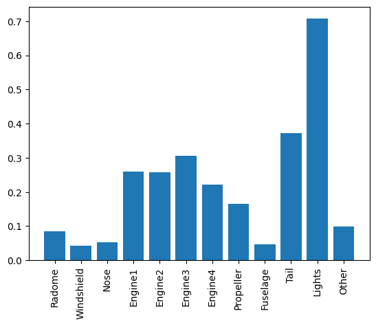

[](https://github.com/nogibjj/mlops-template/actions/workflows/cicd.yml)
[](https://github.com/nogibjj/mlops-template/actions/workflows/codespaces/create_codespaces_prebuilds)

# Week 2: Pandas Descriptive Statistics Project
## This project builds upon the previous mini project to run some descriptive analytics and present the results using Pandas and MatplotLib


## This repo includes the :

* `Jupyter Notebook including script and the visualizations`

* `Python Script`

* `Presented Output and Code in PDF`

* `Presented Output and Code in Markdown`

* `Dockerfile`

A set of libraries in requirements.txt

Things included are:

* `Makefile`

* `Dataset import from Google Drive (Data from Kaggle)`

* `Pytest`

* `pandas`

* `Pylint`

* `Codespaces Configuration`

* `jupyter` and `ipython` 

* `setuptools`
  
* `Matplotlib`

* `githubactions`


# Descriptive Statistics in Pandas
## Below are the commands executed, the analytics obtained, and the visualizations generated:

# Pandas Descriptive Statistics Assignment
## Aircraft wildlife strikes data | 1990 - 2015

In this exercise, we will extract and analyze aircraft wildlife strikes data, and we will determine the probability of each part of an aircraft getting damaged by an aircraft wildlife strike


```python
# Import the necessary libraries

import pandas as pd
import matplotlib.pyplot as plt
import requests
import io
```


```python
# Read our data from Google Drive

file_id = "1TAD7Uyc9PjByt_q13uvGXGeubXnujnUi"
url = f"https://drive.google.com/uc?id={file_id}"

# Download the contents of the CSV file
download = requests.get(url).content

# Read the CSV file into a Pandas DataFrame
df = pd.read_csv(io.StringIO(download.decode("utf-8")), low_memory=False)
```


```python
# Explore the data

df.head()
```


<div>

<table border="1" class="dataframe">
  <thead>
    <tr style="text-align: right;">
      <th></th>
      <th>Record ID</th>
      <th>Incident Year</th>
      <th>Incident Month</th>
      <th>Incident Day</th>
      <th>Operator ID</th>
      <th>Operator</th>
      <th>Aircraft</th>
      <th>Aircraft Type</th>
      <th>Aircraft Make</th>
      <th>Aircraft Model</th>
      <th>...</th>
      <th>Fuselage Strike</th>
      <th>Fuselage Damage</th>
      <th>Landing Gear Strike</th>
      <th>Landing Gear Damage</th>
      <th>Tail Strike</th>
      <th>Tail Damage</th>
      <th>Lights Strike</th>
      <th>Lights Damage</th>
      <th>Other Strike</th>
      <th>Other Damage</th>
    </tr>
  </thead>
  <tbody>
    <tr>
      <th>0</th>
      <td>127128</td>
      <td>1990</td>
      <td>1</td>
      <td>1</td>
      <td>DAL</td>
      <td>DELTA AIR LINES</td>
      <td>B-757-200</td>
      <td>A</td>
      <td>148</td>
      <td>26</td>
      <td>...</td>
      <td>0</td>
      <td>0</td>
      <td>0</td>
      <td>0</td>
      <td>1</td>
      <td>1</td>
      <td>0</td>
      <td>0</td>
      <td>0</td>
      <td>0</td>
    </tr>
    <tr>
      <th>1</th>
      <td>129779</td>
      <td>1990</td>
      <td>1</td>
      <td>1</td>
      <td>HAL</td>
      <td>HAWAIIAN AIR</td>
      <td>DC-9</td>
      <td>A</td>
      <td>583</td>
      <td>90</td>
      <td>...</td>
      <td>0</td>
      <td>0</td>
      <td>0</td>
      <td>0</td>
      <td>0</td>
      <td>0</td>
      <td>0</td>
      <td>0</td>
      <td>1</td>
      <td>0</td>
    </tr>
    <tr>
      <th>2</th>
      <td>129780</td>
      <td>1990</td>
      <td>1</td>
      <td>2</td>
      <td>UNK</td>
      <td>UNKNOWN</td>
      <td>UNKNOWN</td>
      <td>NaN</td>
      <td>NaN</td>
      <td>NaN</td>
      <td>...</td>
      <td>0</td>
      <td>0</td>
      <td>0</td>
      <td>0</td>
      <td>0</td>
      <td>0</td>
      <td>0</td>
      <td>0</td>
      <td>0</td>
      <td>0</td>
    </tr>
    <tr>
      <th>3</th>
      <td>2258</td>
      <td>1990</td>
      <td>1</td>
      <td>3</td>
      <td>MIL</td>
      <td>MILITARY</td>
      <td>A-10A</td>
      <td>A</td>
      <td>345</td>
      <td>NaN</td>
      <td>...</td>
      <td>0</td>
      <td>0</td>
      <td>0</td>
      <td>0</td>
      <td>0</td>
      <td>0</td>
      <td>0</td>
      <td>0</td>
      <td>0</td>
      <td>0</td>
    </tr>
    <tr>
      <th>4</th>
      <td>2257</td>
      <td>1990</td>
      <td>1</td>
      <td>3</td>
      <td>MIL</td>
      <td>MILITARY</td>
      <td>F-16</td>
      <td>A</td>
      <td>561</td>
      <td>NaN</td>
      <td>...</td>
      <td>0</td>
      <td>0</td>
      <td>0</td>
      <td>0</td>
      <td>0</td>
      <td>0</td>
      <td>0</td>
      <td>0</td>
      <td>0</td>
      <td>0</td>
    </tr>
  </tbody>
</table>
<p>5 rows × 66 columns</p>
</div>


```python
df.info()
```

    <class 'pandas.core.frame.DataFrame'>
    RangeIndex: 174104 entries, 0 to 174103
    Data columns (total 66 columns):
     #   Column                Non-Null Count   Dtype  
    ---  ------                --------------   -----  
     0   Record ID             174104 non-null  int64  
     1   Incident Year         174104 non-null  int64  
     2   Incident Month        174104 non-null  int64  
     3   Incident Day          174104 non-null  int64  
     4   Operator ID           174104 non-null  object 
     5   Operator              174104 non-null  object 
     6   Aircraft              174104 non-null  object 
     7   Aircraft Type         133074 non-null  object 
     8   Aircraft Make         131051 non-null  object 
     9   Aircraft Model        122439 non-null  object 
     10  Aircraft Mass         127320 non-null  float64
     11  Engine Make           123434 non-null  float64
     12  Engine Model          121988 non-null  object 
     13  Engines               127342 non-null  float64
     14  Engine Type           127282 non-null  object 
     15  Engine1 Position      126193 non-null  object 
     16  Engine2 Position      118715 non-null  float64
     17  Engine3 Position      11659 non-null   object 
     18  Engine4 Position      3092 non-null    float64
     19  Airport ID            174104 non-null  object 
     20  Airport               173814 non-null  object 
     21  State                 152128 non-null  object 
     22  FAA Region            155202 non-null  object 
     23  Warning Issued        76418 non-null   object 
     24  Flight Phase          118802 non-null  object 
     25  Visibility            109933 non-null  object 
     26  Precipitation         88322 non-null   object 
     27  Height                103677 non-null  float64
     28  Speed                 71258 non-null   float64
     29  Distance              99713 non-null   float64
     30  Species ID            174104 non-null  object 
     31  Species Name          174024 non-null  object 
     32  Species Quantity      169627 non-null  object 
     33  Flight Impact         99465 non-null   object 
     34  Fatalities            565 non-null     float64
     35  Injuries              229 non-null     float64
     36  Aircraft Damage       174104 non-null  int64  
     37  Radome Strike         174104 non-null  int64  
     38  Radome Damage         174104 non-null  int64  
     39  Windshield Strike     174104 non-null  int64  
     40  Windshield Damage     174104 non-null  int64  
     41  Nose Strike           174104 non-null  int64  
     42  Nose Damage           174104 non-null  int64  
     43  Engine1 Strike        174104 non-null  int64  
     44  Engine1 Damage        174104 non-null  int64  
     45  Engine2 Strike        174104 non-null  int64  
     46  Engine2 Damage        174104 non-null  int64  
     47  Engine3 Strike        174104 non-null  int64  
     48  Engine3 Damage        174104 non-null  int64  
     49  Engine4 Strike        174104 non-null  int64  
     50  Engine4 Damage        174104 non-null  int64  
     51  Engine Ingested       174104 non-null  int64  
     52  Propeller Strike      174104 non-null  int64  
     53  Propeller Damage      174104 non-null  int64  
     54  Wing or Rotor Strike  174104 non-null  int64  
     55  Wing or Rotor Damage  174104 non-null  int64  
     56  Fuselage Strike       174104 non-null  int64  
     57  Fuselage Damage       174104 non-null  int64  
     58  Landing Gear Strike   174104 non-null  int64  
     59  Landing Gear Damage   174104 non-null  int64  
     60  Tail Strike           174104 non-null  int64  
     61  Tail Damage           174104 non-null  int64  
     62  Lights Strike         174104 non-null  int64  
     63  Lights Damage         174104 non-null  int64  
     64  Other Strike          174104 non-null  int64  
     65  Other Damage          174104 non-null  int64  
    dtypes: float64(10), int64(34), object(22)
    memory usage: 87.7+ MB
    


```python
df.describe()
```


<div>

<table border="1" class="dataframe">
  <thead>
    <tr style="text-align: right;">
      <th></th>
      <th>Record ID</th>
      <th>Incident Year</th>
      <th>Incident Month</th>
      <th>Incident Day</th>
      <th>Aircraft Mass</th>
      <th>Engine Make</th>
      <th>Engines</th>
      <th>Engine2 Position</th>
      <th>Engine4 Position</th>
      <th>Height</th>
      <th>...</th>
      <th>Fuselage Strike</th>
      <th>Fuselage Damage</th>
      <th>Landing Gear Strike</th>
      <th>Landing Gear Damage</th>
      <th>Tail Strike</th>
      <th>Tail Damage</th>
      <th>Lights Strike</th>
      <th>Lights Damage</th>
      <th>Other Strike</th>
      <th>Other Damage</th>
    </tr>
  </thead>
  <tbody>
    <tr>
      <th>count</th>
      <td>174104.000000</td>
      <td>174104.000000</td>
      <td>174104.000000</td>
      <td>174104.000000</td>
      <td>127320.000000</td>
      <td>123434.000000</td>
      <td>127342.000000</td>
      <td>118715.000000</td>
      <td>3092.000000</td>
      <td>103677.000000</td>
      <td>...</td>
      <td>174104.000000</td>
      <td>174104.000000</td>
      <td>174104.000000</td>
      <td>174104.000000</td>
      <td>174104.000000</td>
      <td>174104.000000</td>
      <td>174104.000000</td>
      <td>174104.000000</td>
      <td>174104.000000</td>
      <td>174104.000000</td>
    </tr>
    <tr>
      <th>mean</th>
      <td>241204.036915</td>
      <td>2006.036392</td>
      <td>7.171840</td>
      <td>15.712264</td>
      <td>3.510611</td>
      <td>21.306958</td>
      <td>2.057656</td>
      <td>2.918570</td>
      <td>2.058538</td>
      <td>831.032283</td>
      <td>...</td>
      <td>0.102703</td>
      <td>0.004733</td>
      <td>0.046242</td>
      <td>0.005813</td>
      <td>0.011235</td>
      <td>0.004176</td>
      <td>0.005962</td>
      <td>0.004216</td>
      <td>0.090727</td>
      <td>0.008989</td>
    </tr>
    <tr>
      <th>std</th>
      <td>94013.682213</td>
      <td>6.747708</td>
      <td>2.790152</td>
      <td>8.799405</td>
      <td>0.873783</td>
      <td>11.023161</td>
      <td>0.469374</td>
      <td>2.008204</td>
      <td>1.441000</td>
      <td>1803.650833</td>
      <td>...</td>
      <td>0.303571</td>
      <td>0.068633</td>
      <td>0.210010</td>
      <td>0.076019</td>
      <td>0.105397</td>
      <td>0.064485</td>
      <td>0.076983</td>
      <td>0.064793</td>
      <td>0.287222</td>
      <td>0.094383</td>
    </tr>
    <tr>
      <th>min</th>
      <td>1000.000000</td>
      <td>1990.000000</td>
      <td>1.000000</td>
      <td>1.000000</td>
      <td>1.000000</td>
      <td>1.000000</td>
      <td>1.000000</td>
      <td>1.000000</td>
      <td>1.000000</td>
      <td>0.000000</td>
      <td>...</td>
      <td>0.000000</td>
      <td>0.000000</td>
      <td>0.000000</td>
      <td>0.000000</td>
      <td>0.000000</td>
      <td>0.000000</td>
      <td>0.000000</td>
      <td>0.000000</td>
      <td>0.000000</td>
      <td>0.000000</td>
    </tr>
    <tr>
      <th>25%</th>
      <td>205411.750000</td>
      <td>2001.000000</td>
      <td>5.000000</td>
      <td>8.000000</td>
      <td>3.000000</td>
      <td>10.000000</td>
      <td>2.000000</td>
      <td>1.000000</td>
      <td>1.000000</td>
      <td>0.000000</td>
      <td>...</td>
      <td>0.000000</td>
      <td>0.000000</td>
      <td>0.000000</td>
      <td>0.000000</td>
      <td>0.000000</td>
      <td>0.000000</td>
      <td>0.000000</td>
      <td>0.000000</td>
      <td>0.000000</td>
      <td>0.000000</td>
    </tr>
    <tr>
      <th>50%</th>
      <td>249102.500000</td>
      <td>2007.000000</td>
      <td>8.000000</td>
      <td>16.000000</td>
      <td>4.000000</td>
      <td>22.000000</td>
      <td>2.000000</td>
      <td>1.000000</td>
      <td>1.000000</td>
      <td>50.000000</td>
      <td>...</td>
      <td>0.000000</td>
      <td>0.000000</td>
      <td>0.000000</td>
      <td>0.000000</td>
      <td>0.000000</td>
      <td>0.000000</td>
      <td>0.000000</td>
      <td>0.000000</td>
      <td>0.000000</td>
      <td>0.000000</td>
    </tr>
    <tr>
      <th>75%</th>
      <td>322592.250000</td>
      <td>2012.000000</td>
      <td>9.000000</td>
      <td>23.000000</td>
      <td>4.000000</td>
      <td>34.000000</td>
      <td>2.000000</td>
      <td>5.000000</td>
      <td>4.000000</td>
      <td>800.000000</td>
      <td>...</td>
      <td>0.000000</td>
      <td>0.000000</td>
      <td>0.000000</td>
      <td>0.000000</td>
      <td>0.000000</td>
      <td>0.000000</td>
      <td>0.000000</td>
      <td>0.000000</td>
      <td>0.000000</td>
      <td>0.000000</td>
    </tr>
    <tr>
      <th>max</th>
      <td>367445.000000</td>
      <td>2015.000000</td>
      <td>12.000000</td>
      <td>31.000000</td>
      <td>5.000000</td>
      <td>92.000000</td>
      <td>4.000000</td>
      <td>7.000000</td>
      <td>5.000000</td>
      <td>31300.000000</td>
      <td>...</td>
      <td>1.000000</td>
      <td>1.000000</td>
      <td>1.000000</td>
      <td>1.000000</td>
      <td>1.000000</td>
      <td>1.000000</td>
      <td>1.000000</td>
      <td>1.000000</td>
      <td>1.000000</td>
      <td>1.000000</td>
    </tr>
  </tbody>
</table>
<p>8 rows × 44 columns</p>
</div>


# Now we are going to calculate the probability of each part of the flight getting damaged and plot these probabilities


```python
strikes = {}
for c in df.columns:
    column_name = c.split(" ")
    # print(len(col_sep), col_sep)
    if len(column_name) > 1 and column_name[1] == "Strike":
        strikes[column_name[0]] = df[column_name[0] + " Damage"].sum() / df[c].sum()
```


```python
# Calculate the probability of each part of the aircraft getting damaged and find the part with the highest damage probability
plt.bar(strikes.keys(), strikes.values())
plt.xticks(rotation=90)
print(max(strikes, key=strikes.get))
```

    Lights
    


    

    


```python

```
